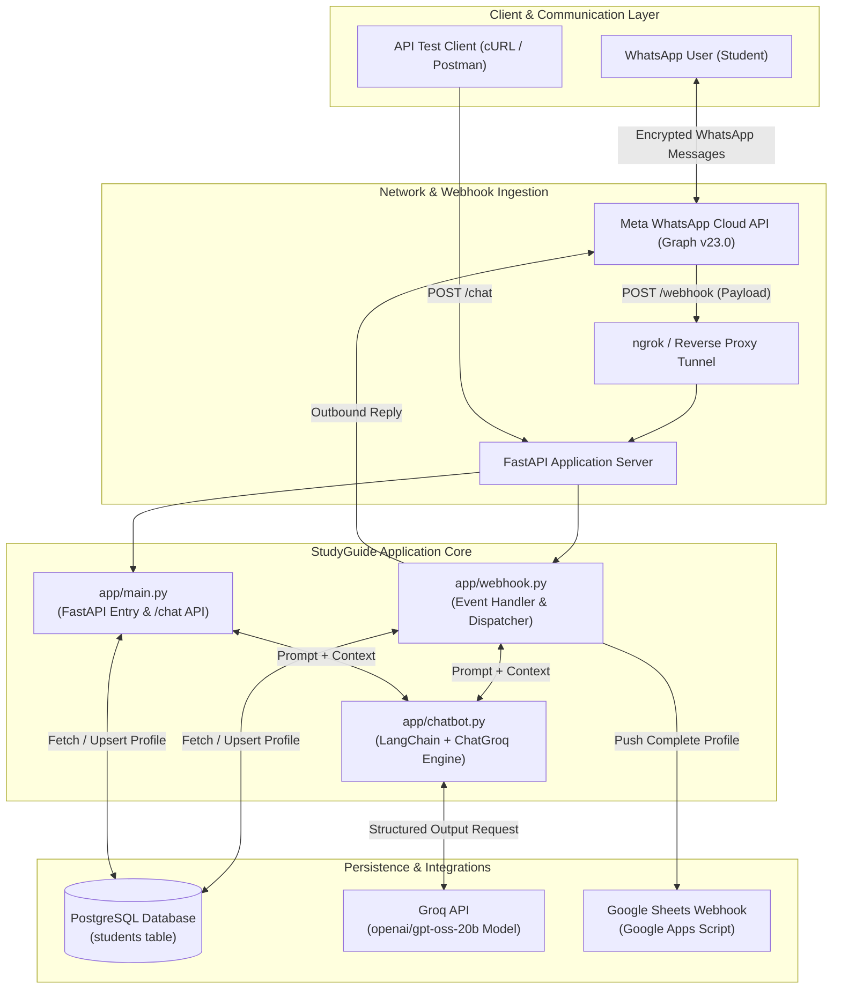
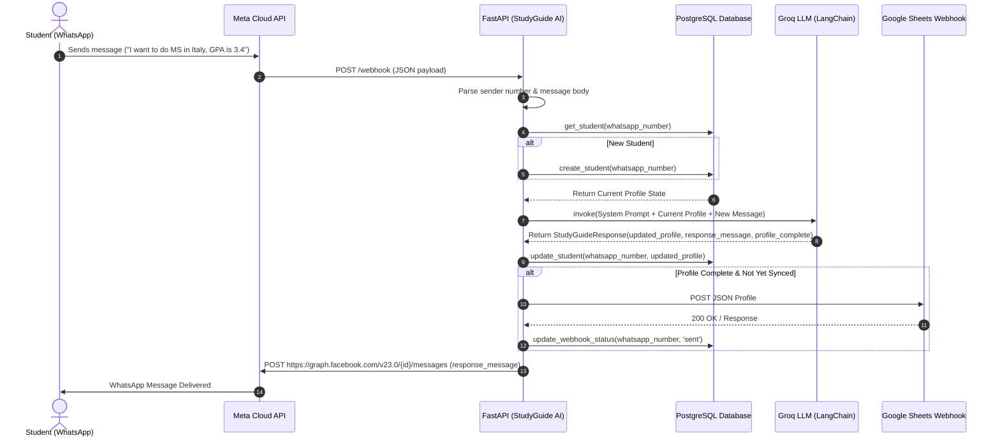

# Software Specification Document: StudyGuide AI

**Project Name:** StudyGuide AI  
**Project Type:** AI-Powered Conversational Lead Intake & Study-Abroad Consultation Backend  
**Author:** Urooj Junaid  
**Document Version:** 1.0  
**Target Environment:** Python 3.12+, FastAPI, PostgreSQL, Groq (LangChain), Meta WhatsApp Cloud API, Google Apps Script  

---

## 1. Executive Summary & Project Overview

### 1.1 Project Purpose
**StudyGuide AI** is an automated backend consultation service designed for educational consultancies. It conducts natural, interactive intake consultations with prospective study-abroad students over **WhatsApp**. 

Instead of forcing students to fill out long, static, and often abandoned web forms or navigating rigid decision-tree bots, StudyGuide AI acts as an experienced human educational consultant. It converses with students in free-form natural language (supporting English, Urdu, and Roman Urdu/mixed text), dynamically extracts structured profile data, answers ad-hoc questions, allows seamless corrections, and synchronizes qualified student leads to an external database and Google Sheets in real time.

### 1.2 Problem Statement
- **High Form Abandonment:** Web forms have high drop-off rates and lack human empathy.
- **Rigid Scripted Bots:** Traditional chatbots follow fixed question trees, failing when users answer multiple questions simultaneously, ask clarifying questions, or change their previous answers.
- **Manual Data Entry Burden:** Educational consultants spend dozens of hours repeatedly collecting standard details (GPA, desired country, budget, intake) before providing tailored advice.

### 1.3 Solution
StudyGuide AI bridges generative AI with deterministic software architecture:
- **LLM as an Extraction & Conversational Engine:** Analyzes unstructured messages and extracts state updates without maintaining server-side conversation state.
- **Relational Persistence (PostgreSQL):** Preserves absolute truth, user identity, and field completeness.
- **Downstream Sync (Google Sheets via Apps Script):** Automatically sends finalized student profiles to operational staff spreadsheets for CRM/follow-up.

---

## 2. System Architecture & Data Flow

### 2.1 Architecture Diagram



### 2.2 End-to-End Message Processing Lifecycle



---

## 3. Technology Stack & Tools

| Category | Technology / Library | Version / Details | Purpose in Project |
| :--- | :--- | :--- | :--- |
| **Programming Language** | Python | `3.12+` | Core backend development language |
| **Web Framework** | FastAPI | `0.141.1` | Asynchronous RESTful API framework and webhook handling |
| **ASGI Web Server** | Uvicorn | `0.53.0` | High-performance ASGI server for hosting FastAPI |
| **AI Orchestration** | LangChain Core / Groq | `langchain 1.4.2`, `langchain-groq 1.1.3` | Integration, prompt assembly, and structured output formatting |
| **LLM Provider** | Groq Cloud | `openai/gpt-oss-20b` | Ultra-low latency inference engine for natural language parsing |
| **Data Validation** | Pydantic v2 | `2.13.5` | Data type enforcement and schema validation for profiles and LLM output |
| **Database Engine** | PostgreSQL | `14+ / 16+` | Relational database for persistent storage of student profiles |
| **Database Driver** | Psycopg2-binary | `2.9.13` | PostgreSQL adapter for Python database connectivity and queries |
| **Messaging Platform** | Meta WhatsApp Cloud API | Graph API `v23.0` | Inbound and outbound WhatsApp messaging integration |
| **Downstream CRM Sync** | Google Apps Script | Web App (`JSON POST`) | Idempotent upsert sync to Google Sheets for non-technical team access |
| **HTTP Client** | Requests | `2.34.2` | Synchronous HTTP calls for Meta API and Google Apps Script |
| **Environment Config** | Python-Dotenv | `1.2.3` | Secure local configuration management via `.env` |
| **Tunneling Tool** | ngrok | Latest | Exposes local development server to public HTTPS for Meta webhooks |

---

## 4. Functional Specifications

### 4.1 Intake Consultation Profile (10 Attributes)
The consultation process is designed to collect exactly 10 parameters necessary for study-abroad evaluation:

| # | Attribute Name | Type | Description / Notes | Example Values |
| :--- | :--- | :--- | :--- | :--- |
| 1 | `name` | String | Full name of the prospective student | `"Alina Khan"`, `"Hamza"` |
| 2 | `current_country` | String | Student's current country of residence | `"Pakistan"`, `"UAE"` |
| 3 | `desired_country` | String | Target study destination | `"Italy"`, `"Germany"`, `"UK"` |
| 4 | `study_level` | String | Intended academic degree level | `"Bachelors"`, `"Masters"`, `"PhD"` |
| 5 | `program` | String | Target field or subject of study | `"Computer Science"`, `"Data Science"` |
| 6 | `previous_qualification` | String | Highest currently completed educational degree | `"BS Software Engineering"`, `"FSc"` |
| 7 | `academic_score` | String | GPA / percentage / marks (stored flexibly) | `"3.45 GPA"`, `"82%"`, `"3.2/4.0"` |
| 8 | `english_test` | String | English proficiency exam status/score | `"IELTS 7.0"`, `"PTE"`, `"Not taken yet"` |
| 9 | `preferred_intake` | String | Target semester/term and year | `"Fall 2026"`, `"Spring 2027"` |
| 10 | `budget` | String | Estimated tuition and living expense budget | `"$25,000"`, `"15-20k Euros/yr"` |

### 4.2 Conversational & Extraction Logic
1. **Zero Multi-turn Hallucination:** The model does not manage long stateful session memory buffers. On every turn, the current profile dictionary is passed to the prompt.
2. **Multi-Field Extraction:** If a student provides multiple details in a single message (e.g., *"I want to do MS in Data Science in Germany for Winter 2026"*), all mentioned fields are parsed and updated in a single pass.
3. **In-Place Corrections:** If a student alters a previous statement (e.g., *"Change my country from Germany to Italy"*), the target key is overwritten without duplicating the student record.
4. **Non-Invasive Follow-ups:** The bot asks for only **one missing field at a time**, maintaining a conversational flow rather than firing a repetitive interrogation list.
5. **Multi-lingual Tolerance:** Understands English, Urdu, and Roman Urdu (transliterated), responding appropriately.
6. **Graceful Q&A Handling:** If a student asks questions (e.g., *"What is the minimum IELTS for Italy?"*), the assistant answers the question naturally without forcing a profile field assignment.

### 4.3 Google Sheets Synchronization
- Triggered automatically when `profile_complete == True` and `webhook_status != 'sent'`.
- Sends an HTTP POST payload containing all 10 student fields + internal `id` + `whatsapp_number` to Google Apps Script.
- Implements an **idempotent upsert**: if the student ID exists in the sheet, it updates the row; otherwise, it appends a new row.
- Updates the database column `webhook_status` to `'sent'`.

---

## 5. Data Schema & Model Specifications

### 5.1 Relational Database Table (`students`)

```sql
CREATE TABLE IF NOT EXISTS students (
    id SERIAL PRIMARY KEY,
    whatsapp_number VARCHAR(30) UNIQUE NOT NULL,
    name VARCHAR(100),
    current_country VARCHAR(100),
    desired_country VARCHAR(100),
    study_level VARCHAR(100),
    program VARCHAR(150),
    previous_qualification VARCHAR(200),
    academic_score VARCHAR(100),
    english_test VARCHAR(100),
    preferred_intake VARCHAR(100),
    budget VARCHAR(100),
    webhook_status VARCHAR(30) DEFAULT 'pending',
    created_at TIMESTAMP DEFAULT CURRENT_TIMESTAMP,
    updated_at TIMESTAMP DEFAULT CURRENT_TIMESTAMP
);
```

### 5.2 Pydantic Data Models

```python
class StudentProfile(BaseModel):
    name: str | None = None
    current_country: str | None = None
    desired_country: str | None = None
    study_level: str | None = None
    program: str | None = None
    previous_qualification: str | None = None
    academic_score: str | None = None
    english_test: str | None = None
    preferred_intake: str | None = None
    budget: str | None = None

class StudyGuideResponse(BaseModel):
    updated_profile: StudentProfile
    response_message: str
    profile_complete: bool
```

---

## 6. API Endpoints Specification

### 6.1 `GET /`
- **Description:** Health check verification endpoint.
- **Response:**
  ```json
  {
    "message": "StudyGuide AI is running"
  }
  ```

### 6.2 `POST /chat`
- **Description:** Direct API for testing conversational extraction without Meta WhatsApp Cloud integration.
- **Request Body:**
  ```json
  {
    "whatsapp_number": "923001234567",
    "user_message": "Hi, I am Alina from Pakistan and I want to study Masters in AI in Germany."
  }
  ```
- **Response Body:**
  ```json
  {
    "response": "Hello Alina! Germany is a fantastic choice for Masters in AI. What was your previous qualification and academic score?",
    "profile": {
      "name": "Alina",
      "current_country": "Pakistan",
      "desired_country": "Germany",
      "study_level": "Masters",
      "program": "AI",
      "previous_qualification": null,
      "academic_score": null,
      "english_test": null,
      "preferred_intake": null,
      "budget": null
    },
    "profile_complete": false
  }
  ```

### 6.3 `GET /webhook`
- **Description:** Meta WhatsApp webhook handshake endpoint.
- **Query Parameters:** `hub.mode`, `hub.verify_token`, `hub.challenge`.
- **Behavior:** Returns `hub.challenge` as plain text when `hub.verify_token == META_VERIFY_TOKEN`; returns HTTP 403 otherwise.

### 6.4 `POST /webhook`
- **Description:** Receives real-time WhatsApp incoming events from Meta Cloud API.
- **Behavior:** Extracts `sender` phone number and `message_text`, executes profile query/update via LLM, triggers Google Sheets sync on completion, and sends reply back to WhatsApp.

---

## 7. Configuration & Environment Variables

The project requires the following environment variables in a `.env` file:

```env
# LLM Provider Configuration
GROQ_API_KEY=gsk_...

# PostgreSQL Database Configuration
POSTGRES_HOST=localhost
POSTGRES_PORT=5432
POSTGRES_USER=postgres
POSTGRES_PASSWORD=your_secure_password
POSTGRES_DB=studyguide_ai

# Meta WhatsApp Cloud API Configuration
META_VERIFY_TOKEN=your_custom_verification_token
META_ACCESS_TOKEN=EAAG...
META_PHONE_NUMBER_ID=109283746501928
META_WABA_ID=987654321098765

# Google Sheets Webhook Integration
GOOGLE_SHEETS_WEBHOOK_URL=https://script.google.com/macros/s/.../exec
```

---

## 8. Directory & File Structure

```
studyGuide_AI/
├── app/
│   ├── __init__.py           # Application package initializer
│   ├── main.py               # FastAPI entry point & direct /chat endpoint
│   ├── chatbot.py            # LangChain Groq configuration, Pydantic schemas & prompt
│   ├── database.py           # PostgreSQL connection, table DDL, and CRUD operations
│   └── webhook.py            # Meta webhook verification, message pipeline & Sheets sync
├── data-deletion.html        # Meta compliance data deletion policy page
├── privacy_policy.html       # Meta compliance privacy policy page
├── terms_of_service.html     # Meta compliance terms of service page
├── requirements.txt          # Python project dependencies
├── test_meta.py              # Verification utility for Meta Graph API connectivity
├── .env.example              # Template for required environment variables
├── README.md                 # Project user guide and overview
└── spec.md                   # Complete Software Specifications Document
```

---

## 9. Non-Functional Specifications & Security

1. **Deterministic Data Integrity:** LLM is strictly constrained via `with_structured_output(StudyGuideResponse)` ensuring 100% adherence to the Pydantic schema without string regex or fragile parsing.
2. **State Isolation:** PostgreSQL is the single source of truth. The application remains fully stateless across HTTP turns.
3. **Data Security & Privacy:** 
   - No sensitive API keys or credentials committed to source control.
   - Dedicated `privacy_policy.html` and `data-deletion.html` provided for Meta Compliance and User Rights.
4. **Fault Tolerance:** If external outbound integrations (Google Sheets webhook or WhatsApp Graph API) experience transient errors, the core student profile is safely saved in PostgreSQL.
